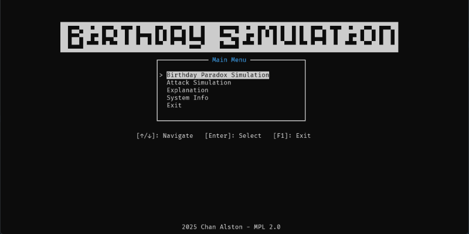

# Birthday Simulation

This is a TUI (Terminal User Interface) application written in C that shows how birthday paradox works, prove how birthday attack can finds collision in less than half of the hash space count.



## Getting Started

To run, build or develop the application, you should start from here.

### Get the executables

You can download the executable from [GitHub release](https://github.com/AlstonChan/birthday-simulation/releases/latest).

### Library Used

- [OpenSSL](https://www.openssl.org/) - For generating cryptographically random bytes for hashing, which also provides the hash function the program needed like `sha256`, `sha512`, etc..
- [ncurses](https://invisible-island.net/ncurses/) - The core library to build UI in this CLI application
- [GLib](https://docs.gtk.org/glib/index.html) - To use their thread pool implementation for calculating hashes concurrently without block the main/UI thread

## Prerequisites

- If you are on Windows, you need to install [MSYS2](https://www.msys2.org/). That should also install **UCRT64** for you.
- Install all library listed in the [Library Used](#library-used) section. In windows, you should use the `UCRT64` terminal and pacman to search and install the library.
- Install `CMake` and `make`

### Build

1. Clone the repository into your local machine

   ```bash
   git clone https://github.com/AlstonChan/birthday-simulation.git
   ```

2. Install the dependencies package

   - For linux:

      ```bash
      sudo apt update && sudo apt install build-essential libncurses5-dev libncursesw5-dev libssl-dev libglib2.0-dev libc6-dev libzstd-dev libtinfo-dev gdb valgrind clang-format
      ```

   - For Windows:

      Open your MSYS2-UCRT64 command line:

      Update and upgrade all the packages, you MAY need to run this command multiple times until you see the message `there is nothing to do`.

      ```bash
      pacman -Syu
      ```

      Install the toolchain:

      ```bash
      pacman -S --needed base-devel mingw-w64-ucrt-x86_64-toolchain
      ```

      then install the packages:

      ```bash
      pacman -S mingw-w64-ucrt-x86_64-glib2 mingw-w64-ucrt-x86_64-ncurses mingw-w64-ucrt-x86_64-openssl
      ```

3. Generate the `make` file with `CMake`, for your platform:

   On Windows, using **MinGW**

   ```powershell
   cmake -S . -B build -G "MinGW Makefiles"
   ```

   On Linux/Unix, using the standard unix makefile

   ```bash
   cmake -S . -B build -G "Unix Makefiles"
   ```

4. Run `make` to build the application

   ```bash
   make -C build
   ```

### Documentations

1. To build and view the documentations locally, install doxygen

   ```bash
   sudo apt update && sudo apt install doxygen
   ```

   or install it from the [doxygen website](https://www.doxygen.nl/download.html) if you have a GUI

2. Generate the documentation site to `docs`

   ```bash
   doxygen Doxyfile
   ```

3. View the site

   ```bash
   open ./docs/html/index.html
   ```

## Resources

- [Ncurses How to Guide](https://invisible-island.net/ncurses/howto/NCURSES-Programming-HOWTO.html)
- [Ncurses manual](https://invisible-island.net/ncurses/man/ncurses.3x.html)
- [Ncurses Menu manual](https://invisible-island.net/ncurses/man/menu.3x.html)
- [Ncurses Form manual](https://invisible-island.net/ncurses/man/form.3x.html)
- [The Birthday Paradox by Vsauce2 on Youtube](https://www.youtube.com/watch?v=ofTb57aZHZs)
- [Check your intuition: The birthday problem - David Knuffke on Youtube](https://www.youtube.com/watch?v=KtT_cgMzHx8)
